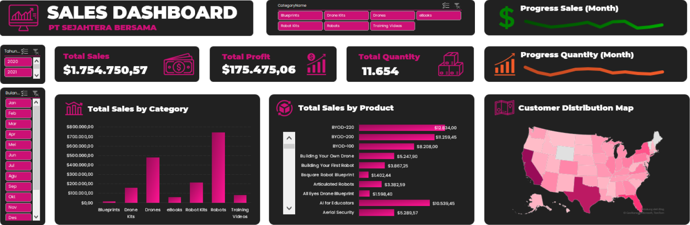

# VIX Bank Muamalat
Project-Based Internship as a Business Intelligence Analyst in Bank Muamalat x Rakamin Academy

## Project Background
Sebagai BI Analyst di Bank Muamalat, saya diberikan 5 tugas yang harus diselesaikan:
1. Mengidentifikasi Primary Key dari dataset.
2. Membuat Entity Relationship Diagram dari dataset.
3. Membuat master table dari dataset.
4. Membuat Dashboard Sales menggunakan Ms. Excel dari data master table.
5. Memberikan rekomendasi berdasarkan dashboard.

Tools:
1. MySQL
2. Microsoft Access
3. Microsoft Excel

## 1. Mengidentifikasi Primary Key dari dataset.
1. Primary key tabel Customer : `CustomerID`
2. Primary key tabel Product : `ProdNumber`
3. Primary key tabel Orders : `OrderID`
4. Primary key tabel ProductCategory : `CategoryID`

## 2. Membuat Entity Relationship Diagram dari dataset.

    
Fig 1. Entity Relationship Diagram

## 3. Membuat master table dari dataset.

    
Fig 2. Master Table

**The Query :**

    
Fig 3. Query Master Table

## 4. Dashboard Sales.
[Check the interactive dashboard here](https://docs.google.com/spreadsheets/d/1YCiBykw85I99LjrPL-4u3HFHO70uTNmT/edit?usp=sharing&ouid=102065389754958881026&rtpof=true&sd=true)

    
Fig 4. Dashboard Sales PT. Sejahtera Bersama

## 5. Rekomendasi berdasarkan dashboard.

1. eBooks merupakan kategori yang memiliki order quantity tinggi namun memiliki total sales yang rendah, sehingga disarankan untuk meningkatkan harga serta memberikan penawaran spesial pada produk produk dalam kategori eBooks untuk meningkatkan sales.
2. Robots merupakan kategori yang memiliki total sales paling tinggi namun order quantity rendah, sehingga disarankan untuk memberikan diskon kepada para buyer yang akan membeli produk robot dengan jumlah yang banyak.
3. Meningkatkan promosi dan memberikan diskon pada kota dengan penjulan sedikit.

